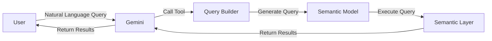

+++
title = "Hack Diary: Natural Language Queries of Data Using a Semantic Layer"
date = "2026-06-22"
description = "Exploring natural language queries of data using a semantic layer."
tags = ["ai", "data"]
mermaid = true
+++

Recently my team at Autotrader did a hack on ways to improve the experience of the data platform for our colleagues. The aim of this hack wasn't necessarily to produce production ready software, but to give the team exposure to AI based workflows and Semantic Layers.One of the biggest pain points we have is that we have a **lot** of data, dashboards and reports and it can be hard to find the right one. Especially in meetings where sometimes someone will ask "How many X did we have last week?" and then someone might have to step back from the conversation and find the right dashboard, in which case the meeting has probably already moved on.

## Building and Querying Semantic Model

There are lots of Semantic Layer vendors available but we wanted something lightweight that could be easily integrated with a Python web app for the purposes of the hack. We ended up with a ORM like approach similar to [sqlalchemy declarative](https://docs.sqlalchemy.org/en/13/orm/extensions/declarative/basic_use.html). 

A semantic model looks a bit like this:

```python
class Penguins(Model):
    __source__ = (DuckdbSource.from_path("./penguins.parquet"),)
    species: Dimension = dimension(lambda t: t.species, description="Also known as type")
    island: Dimension = dimension(lambda t: t.island)
    bill_length_mm: Dimension = dimension(lambda t: t.bill_length_mm)

    penguin_count: Measure = measure(lambda t: t.count())

    average_bill_length_mm: Measure = bill_length_mm.measure(lambda d: d.mean())
```

Where dimensions are categorical fields and measures are aggregations. 
The model also supported simple join relationships.

The Semantic model could then be queried using a simple query builder which we can later expose as a tool 
call for the LLM. For example if you wanted to know the number of penguins by species you could do:

```python
    sl.query_model(
        Penguins,
        dimensions=[Penguins.species],
        measures=[Penguins.penguin_count],
    ).to_pandas()
# Output:
# species  penguin_count
# Adelie  152
# Chinstrap  68
# Emperor  124 
```

## Hooking up Gemini

We use GCP at Autotrader so [Gemini Enterprise Agent Platform](https://cloud.google.com/products/gemini-enterprise-agent-platform) was a natural choice here to get something up and running. The basic execution flow was to take the natural language query, pass it to Gemini which would then call our query builder tool to generate a query and then return the results:



The Semantic Layer would template into the tool's schema the permitted models,
measures and dimensions so the LLM would not be able to hallucinate dimensions and measures that should be there. We would also give 
feedback to the LLM if the query was invalid and so it could try again.

## Building an Interface

We only had 3 days for the hack so had to get something demonstrable up and running fast! We ended up with a Streamlit app that would expose a simple chat interface to the LLM. The interface would output a representation of the query so you could verify it had done 
the right thing and then the results of the query as a table:


## What's Next?

From this hack we learned that LLMs can quite easily be hooked up to a semantic layer to allow natural language queries 
of data in our data platform. The positives of this approach is that the LLM is constrained by the semantic model 
and so is more likely to generate the correct query than if it was just given the schema of our 
data. Cube [offers this feature](https://docs.cube.dev/docs/explore-analyze/analytics-chat?_gl=1*1gyj65h*_gcl_au*NjIyMjk3NTY4LjE3ODIxNTQ1OTc.#how-it-works) in its Semantic Layer offering already as well and the [open semantic interchange](https://open-semantic-interchange.org/) has been designed around giving AI context about the semantic model from the start.
