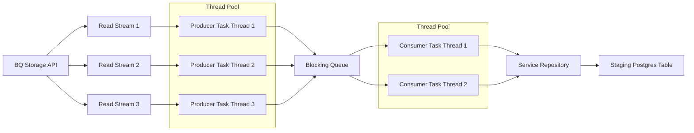

+++
title = "Transferring billion row datasets from BiqQuery into Postgres"
date = "2026-07-14"
description = "Replacing Apache Beam with an in-house solution"
tags = ["bigquery", "data", "postgres", "mongo"]
mermaid = true
+++

A common challenge in data engineering is figuring out how to move one large dataset that is in one structure, format or cloud region and transforming into another without creating a large cloud bill or having to wait a long time for a batch job to complete. At Autotrader we do a lot of batch processing using [dbt](https://www.getdbt.com/) and BigQuery. The result of this processing often results in datasets that we want to then export to operational datastores such as Postgres or Mongo. We can then surface these datasets in embedded analytics products which require the low latency that Postgres and Mongo can deliver.

# Moving away from Apache Beam

We were using Google's managed Apache Beam solution [Cloud Dataflow](https://docs.cloud.google.com/dataflow/docs), but it had a lot of downsides in how it integrated with our delivery and data platforms. Beam provides I/O connectors for BigQuery and JDBC so the Pipeline was structured in a basic source/sink model:


This solution worked but it violated a fundamental principle of our approach to microservices which is that a service's operational data store should be owned and managed by the service itself. In this case, the Beam pipeline existed in a seperate repository from the microservice and it was not trivial to say modify the schema of the Postgres table without having to make concurrent changes to the Beam pipeline. The service was also not in charge of bringing the new dataset 'live', the Beam jobs would submit DDL into the Postgres database that would swap in the new dataset even if the service was not ready or under high traffic.

# The operational service is responsible for ingesting data from the data platform

This was the title of our [ADR](https://adr.github.io/) that we wrote to describe our new approach. We would uphold the principle of the service being responsible for its operational datastore by moving the data transfer pipeline into the service itself. 

The services that power our embedded analytics products are Rest APIs, written in Springboot and follow the Controller, Service, Repository pattern:

   - Controller: Exposes the API endpoints and handles HTTP requests and responses
   - Service: Contains the business logic and orchestrates the data transfer process
   - Repository: Handles the data access and persistence layer, interacting with the Postgres database

The key idea is that the repository layer of the service could be extended to support batch ingestion of data into the Postgres datastore.

# Building a Springboot library to transfer data

We decided on a similar architecture to the Beam pipeline but wrote our own connector for BigQuery which leveraged the [BigQuery Storage API](https://cloud.google.com/bigquery/docs/reference/storage) to rapidly read rows staged into BigQuery tables. The storage API is a low-level API that allows very high throughput reads of BQ datasets by bypassing the compute layer in BigQuery. A downside of this is that you cannot query tables using SQL and it only supports basic predicate filtering and projections. When you initialise a read session the API will return a set of streams that can be read in parallel. We offload each stream into a thread pool which pushes each row onto a finite BlockingQueue, this ensure's we don't cause an OOM if BigQuery is able to read rows faster than Postgres can write them. We then have a seperate thread pool which reads rows from the queue and maps them into Entities that the repository layer can persist in batches into a staging Postgres table. The architecture looks like this:



Once the data was in the staging table the service could then perform the necessary transformations and DDL to bring the new dataset live into the operational tables.

# Speeding up write throughput

One problem we encountered when performance testing this solution was that we had a bottleneck in inserting rows into Postgres. BigQuery reads were much faster and so often we would be filling up the queue faster than we could sink rows. We ended up solving this by making the staging table an [unlogged table](https://www.postgresql.org/docs/current/sql-createtable.html#SQL-CREATETABLE-UNLOGGED) which is a Postgres feature that allows you to bypass the write-ahead log (WAL) and therefore speed up writes. We also excluded all constraints and indexes on the staging table:

```sql
CREATE UNLOGGED TABLE staging_table (LIKE operational_table EXCLUDING ALL);
```

The downside of this is that if something were to happen to the database whilst it was ingesting data there would be no way to recover the staging data. However by ensuring our transfer job was idempotent we could simply re-run the job if it failed.

# Bringing the data live

Once all the data was in the staging table we then performed the necessary DDL to swap in the new data into the live table. This ended up looking very similar to dbt's [insert_overwrite](https://docs.getdbt.com/docs/build/incremental-strategy?version=2.0&name=Fusion#insert_overwrite) strategy where the new data is inserted as a partition which is attached to the main table. This ensured a zero downtime swap of the new dataset so our customer's experience was not impacted.

# Orchestration

The final component of this new platform capability was scheduling. We use [Airflow](https://airflow.apache.org/) to schedule our batch jobs and so we needed a way to trigger the data transfer job after the new dataset was ready to be ingested. We already had a platform capablity to schedule [Kubernetes jobs](https://kubernetes.io/docs/concepts/workloads/controllers/job/) from a delivery platform API, therefore hooking it up to Airflow was just a matter of creating a new operator that would call the delivery platform API to schedule the job. The operator would then poll the job status until it was complete or failed. Airflow could then retry the job if it failed because we had designed the data transfer job to be idempotent.

# Was it worth it?

Implementing this platform capabilty significantly reduced the time it took to create new transfer jobs. Creating new Beam pipelines was slow because it was much harder to test as the code for transferring data and the service existed in seperate repositories. The new solution allowed us to create end-to-end integration tests that run in CICD giving developers much more confidence that the job would work in production as long as the BigQuery dataset did not violate it's contract and cause a breaking change. Using a simple K8 Job meant that we didn't have to spin up an entire Beam cluster which also reduced our infrastructure costs. Other teams havea also adopted this approach and have contributed new data sources allowing us to read Delta tables and Parquet in a similar way.